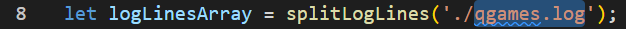
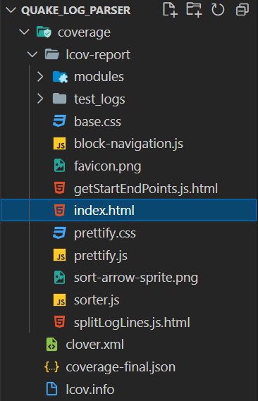

# Quake Log Parser

## Introduction
System that parses Quake log files and groups game data for each match. In order to achieve this, it splits the log file into an array of strings, where each log line is represented by a string element. After this, it searches for keywords such us "*InitGame*" or "*Kill*" to determine where each match begins, keep track of the kill counts, and so forth. Finally, it converts all of the raw data into a comprehensive and complete **groupedInfo.json** file with a players' ranking for each match.

Feel free to fork this project and try it for yourself!

## Tech Stack
<div style="display: inline_block"><br>
  
  
  
</div>

- JavaScript
- Node
- Jest

## How to Use It

1. Clone the project
```
git clone <url>
```
2. Install the dependencies
```
npm install
```
3. Execute the app.js file
```
node app
```
4. Open **grouped_information.json** file from the root directory

This project comes with a quake log file by default. If you wish to use a different file you simply need to include it on the project's root directory and change the file path being sent as a parameter for splitLogLines function on the app.js file, on line 8: <br />


## Testing Coverage
To verify the testing coverage applied to this project you can open the **index.html** file, located on **coverage/lcov-report/index.html**: <br />
 <br />
We suggest using an extension such as Live Server for optimum readability.
